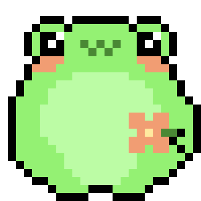

       

<h3> Currently working on <a href=""> Decomposer </a>

<h1> PL </h1>
<h3>Witaj, miło cię widzieć!  </h3>
Jestem Alina znana głównie jako Nithael, grafik i artysta zajmujący się głównie ilustrowaniem i projektem graficznym  
Uwielbiam pracować kreatywnie, więc jeśli cię to interesuje z wielką chęcią zapraszam do zapoznania się z moimi pracami. Z czasem oczywiście ich zasób się rozrośnie, tak samo jak moje doświadczenie. Mam nadzieję na pozytywną współpracę.
 .・。.・゜✭・.・✫・゜・。. 
<a href="https://github.com/NithaelaZ/Fairy-garden/tree/main/Pretty-Leafs"> Tutaj</a> zobaczycie kilka prac jak i poniżej.      
<a href="https://github.com/NithaelaZ/Fairy-garden/tree/main/Flowery-fields"> Tutaj</a>  z kolei możecie zobaczyć kilka z moich konceptów    

Pracowałam nad kilkoma grami jako programista w ramach Lem-jam i Cyberiady

Poniżej zobaczysz listę języków programowania z jakich potrafię korzystać

<ul>
    <li>HTML 5</li>
    <li>PHP</li>
    <li>JavaScript</li>
    <li>CSS</li>
    <li>Python</li>
    <li>C#</li>
    <li>C/++</li>

 </ul> 

 Jednak z chęcią poszerzę swoją wiedzę o nowe    
 

 <h1> ENG </h1> 

<h3>Hello, It's a pleasure to meet you!   </h3>
The name is Alina mostly known as Nithael. Self-taught graphic designer who mainly ilustrates and digitally designs  
I love to work creativly so if you're interested in that aspect go ahead and check what's in store for you here. I plan to grow this page along with my experience. I hope for great cooperation.
 .・。.・゜✭・.・✫・゜・。. 
<a href="https://github.com/NithaelaZ/Fairy-garden/tree/main/Pretty-Leafs"> Here</a> is some of my work, below you can see some of them.   
<a href="https://github.com/NithaelaZ/Fairy-garden/tree/main/Flowery-fields"> Here</a> on the other hand you can find some of my concept art    

I wokred on two games as a part of Cyberiada project and Lem-jam    

Also here's the list of coding lamguages I know

<ul>
    <li>HTML 5</li>
    <li>PHP</li>
    <li>JavaScript</li>
    <li>CSS</li>
    <li>Python</li>
    <li>C#</li>
    <li>C/++</li>

 </ul> 
 
 But I would gladly learn more  

<h1> Past indie projects:   </h1>
<h2> 
    <ul>
        <li> <a href="https://github.com/M4przybysz/KeroKero"> KeroKero </a> </li>

 </ul> 
   

     
  Both gifs were made by me, inspired from the internet, below are some of my art  

